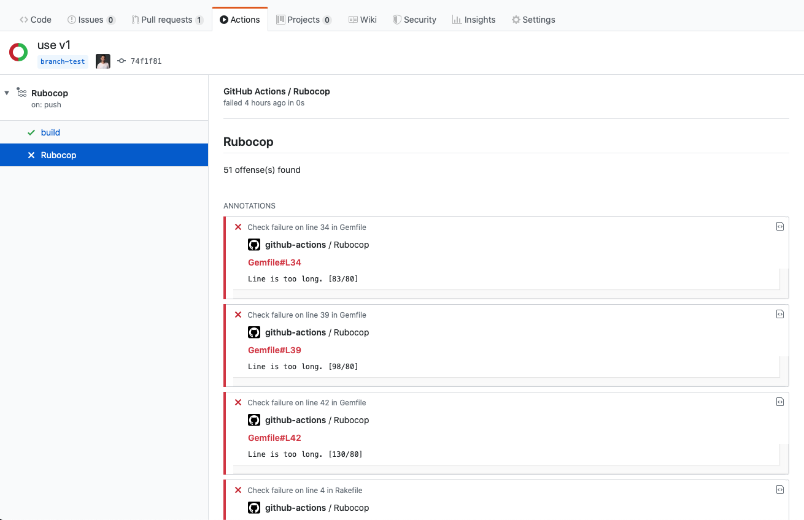

[](/CHANGELOG.md)

[](#contributors)

# :white_check_mark: Rubocop Linter Action

A GitHub Action to run [Rubocop](https://github.com/rubocop-hq/rubocop) against your code and create annotations in the GitHub UI.

- [:white_check_mark: Rubocop Linter Action](#whitecheckmark-rubocop-linter-action)
  - [:page_facing_up: Introduction](#pagefacingup-introduction)
  - [:bulb: Usage](#bulb-usage)
    - [:package: Example Workflow](#package-example-workflow)
    - [:moneybag: Available Inputs](#moneybag-available-inputs)
  - [:warning: Gotchas](#warning-gotchas)
  - [:camera_flash: Screenshots](#cameraflash-screenshots)
  - [:bookmark: Changelog](#bookmark-changelog)
  - [:sos: Contributing](#sos-contributing)
  - [:rotating_light: Code of Conduct](#rotatinglight-code-of-conduct)
  - [:copyright: License](#copyright-license)
  - [:1st_place_medal: Recognition](#1stplacemedal-recognition)
  - [:robot: Check Out My Other Ruby GitHub Actions](#robot-check-out-my-other-ruby-github-actions)
  - [✨ Contributors](#%e2%9c%a8-contributors)

## :page_facing_up: Introduction

GitHub Actions are an amazing new tool that can dramatically improve productivity while using the GitHub platform. While it is not hard to write a custom GitHub action to run Rubocop on your codebase, this action takes that functionality one step further using the checks API. After the Rubocop Linter Action runs Rubocop against your code, it will create annotations that you can easily view, matched up with the offending code.

Since GitHub actions and the checks API are continually changing, it is possible that there will be breaking API changes that affect this action. If so, please open an issue and I will look into it as soon as I can.

## :bulb: Usage

Add the following to your GitHub action workflow to use Rubocop Linter Action:

```yaml
- name: Rubocop Linter
  uses: andrewmcodes/rubocop-linter-action@v2.0.0
  with:
    additional_gems: 'rubocop-rails rubocop-performance'
    fail_level: 'warning'
  env:
    GITHUB_TOKEN: ${{ secrets.GITHUB_TOKEN }}
```

It is **highly** recommend you tie yourself to a version and do not do the following. I promise your life will be much easier. 😇

```yml
# ❌ Danger, sometimes I break things!
uses: andrewmcodes/rubocop-linter-action@master

# ✅ Much better.
uses: andrewmcodes/rubocop-linter-action@2.0.0
```

### :package: Example Workflow

Here is an example workflow file incorporating Rubocop Linter Action:

```yaml
name: Rubocop

on: [push]

jobs:
  build:
    runs-on: ubuntu-latest
    steps:
    - uses: actions/checkout@v1
    - name: Rubocop Linter
      uses: andrewmcodes/rubocop-linter-action@v2.0.0
      with:
        additional_gems: 'rubocop-rails rubocop-performance'
        fail_level: 'warning'
      env:
        GITHUB_TOKEN: ${{ secrets.GITHUB_TOKEN }}
```

**Go [here](https://github.com/andrewmcodes/rubocop-linter-action-playground/blob/master/.github/workflows/test.yml) to see more examples!**

### :moneybag: Available Inputs

| **Input Parm Name** | **Required** | **Default Value** | **Description**                                                                                       | **Examples of Equivalent Local Commands**                                  |
| ------------------- | ------------ | ----------------- | ----------------------------------------------------------------------------------------------------- | -------------------------------------------------------------------------- |
| bundle              | false        | false             | If you would like to run `bundle install` on your project instead of `gem install`                    | `bundle install --deployment --jobs 4 --retry 3`                           |
| version             | false        | latest GA         | Define a later version of rubocop if latest is not needed                                             | `gem install rubocop -v 0.76.0`                                            |
| additional_gems     | false        |                   | Additional Gems can be installed via one line with spaces and commands are supported like a version   | `gem install rubocop-rails rubocop-performance 'rubocop-i18n:2.0.0'`         |
| config_path         | false        | repo ./           | If the config path is another spot in the repo or not named `.rubocop.yml`                            | `rubocop -c .rubocop_config_test.yml`                                      |
| exclude_cops        | false        |                   | Define a list of paths to exclude from being linted.                                                  | `rubocop --except 'Style/FrozenStringLiteralComment Style/StringLiterals'` |
| fail_level          | false        | 'warning'         | Can define `refactor`, `convention`, `warning`, `error` and 'fatal' to cause Rubocop to error out on. | `rubocop --fail-level 'warning'`                                           |

## :warning: Gotchas

1. Due to the GitHub Check Runs API, we can only return 50 annotations per run. See [here](https://developer.github.com/v3/checks/runs/#output-object) for more info.
2. There is a bug with the Checks API that might cause your runs to get jumbled in the UI, but they will all still run and render annotations in the diff correctly.
3. You can't use --version with multiple gems. You can specify multiple gems with version requirements using `gem install 'my_gem:1.0.0' 'my_other_gem:~>2.0.0'`

## :camera_flash: Screenshots




## :bookmark: Changelog

[View our Changelog](/CHANGELOG.md)

## :sos: Contributing

[Contributing Guide](/CONTRIBUTING.md)

## :rotating_light: Code of Conduct

[Code of Conduct](/CODE_OF_CONDUCT.md)

## :copyright: License

[MIT](/LICENSE.md)

## :1st_place_medal: Recognition

This project was originally forked from [gimenete/rubocop-action](https://github.com/gimenete/rubocop-action). Many thanks to [Alberto Gimeno](https://github.com/gimenete) for creating this project.

## :robot: Check Out My Other Ruby GitHub Actions

- [andrewmcodes/haml-lint-action](https://github.com/andrewmcodes/haml-lint-action).
- [andrewmcodes/standardrb-action](https://github.com/andrewmcodes/standardrb-action).

## ✨ Contributors

Thanks goes to these wonderful people ([emoji key](https://allcontributors.org/docs/en/emoji-key)):

<!-- ALL-CONTRIBUTORS-LIST:START - Do not remove or modify this section -->
<!-- prettier-ignore -->
<table>
  <tr>
    <td align="center"><a href="https://www.andrewmason.me/"><br /><sub><b>Andrew Mason</b></sub></a><br /><a href="#infra-andrewmcodes" title="Infrastructure (Hosting, Build-Tools, etc)">🚇</a> <a href="#review-andrewmcodes" title="Reviewed Pull Requests">👀</a> <a href="https://github.com/andrewmcodes/rubocop-linter-action/commits?author=andrewmcodes" title="Documentation">📖</a> <a href="https://github.com/andrewmcodes/rubocop-linter-action/commits?author=andrewmcodes" title="Code">💻</a></td>
    <td align="center"><a href="https://github.com/MiguelSavignano"><br /><sub><b>Miguel Savignano</b></sub></a><br /><a href="#infra-MiguelSavignano" title="Infrastructure (Hosting, Build-Tools, etc)">🚇</a> <a href="https://github.com/andrewmcodes/rubocop-linter-action/commits?author=MiguelSavignano" title="Tests">⚠️</a> <a href="https://github.com/andrewmcodes/rubocop-linter-action/commits?author=MiguelSavignano" title="Code">💻</a></td>
    <td align="center"><a href="https://github.com/mcgregordan"><br /><sub><b>Dan McGregor</b></sub></a><br /><a href="https://github.com/andrewmcodes/rubocop-linter-action/commits?author=mcgregordan" title="Documentation">📖</a></td>
    <td align="center"><a href="https://github.com/amerritt14"><br /><sub><b>amerritt14</b></sub></a><br /><a href="https://github.com/andrewmcodes/rubocop-linter-action/commits?author=amerritt14" title="Code">💻</a></td>
    <td align="center"><a href="https://github.com/bbugh"><br /><sub><b>Brian Bugh</b></sub></a><br /><a href="https://github.com/andrewmcodes/rubocop-linter-action/commits?author=bbugh" title="Code">💻</a> <a href="https://github.com/andrewmcodes/rubocop-linter-action/commits?author=bbugh" title="Tests">⚠️</a></td>
    <td align="center"><a href="http://reidbeels.com"><br /><sub><b>Reid Beels</b></sub></a><br /><a href="https://github.com/andrewmcodes/rubocop-linter-action/commits?author=reidab" title="Code">💻</a> <a href="https://github.com/andrewmcodes/rubocop-linter-action/commits?author=reidab" title="Tests">⚠️</a></td>
    <td align="center"><a href="http://www.chris-pezza.com"><br /><sub><b>Christopher Pezza</b></sub></a><br /><a href="https://github.com/andrewmcodes/rubocop-linter-action/commits?author=chiefpansancolt" title="Code">💻</a> <a href="https://github.com/andrewmcodes/rubocop-linter-action/commits?author=chiefpansancolt" title="Documentation">📖</a> <a href="#infra-chiefpansancolt" title="Infrastructure (Hosting, Build-Tools, etc)">🚇</a></td>
  </tr>
</table>

<!-- ALL-CONTRIBUTORS-LIST:END -->

This project follows the [all-contributors](https://github.com/all-contributors/all-contributors) specification. Contributions of any kind welcome!
