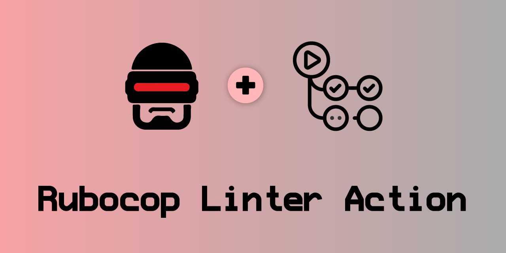
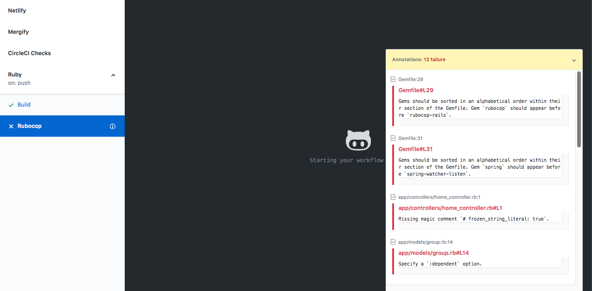

[](#contributors)

# Rubocop Linter Action


GitHub Action to run Rubocop against your code and create annotations in the UI.

**NOTE: due to the GitHub Check Runs API, we can only return 50 annotations per run. See [here](https://developer.github.com/v3/checks/runs/#output-object) for more info.**

## Usage

Add the following to your GitHub action workflow:

```yaml
- name: Rubocop Linter
  uses: andrewmcodes/rubocop-linter-action@v0.2.0
  env:
    GITHUB_TOKEN: ${{ secrets.GITHUB_TOKEN }}
```

## Example Workflow

```yaml
name: Rubocop

on:
  pull_request:
    branches:
      - '*'
  push:
    branches:
      - master

jobs:
  build:
    runs-on: ubuntu-latest
    steps:
    - uses: actions/checkout@v1
    - name: Rubocop Linter
      uses: andrewmcodes/rubocop-linter-action@v0.2.0
      env:
        GITHUB_TOKEN: ${{ secrets.GITHUB_TOKEN }}
```

## Screenshots



## Contributing

[Contributing Guide](/CONTRIBUTING.md)

## Code of Conduct

[Code of Conduct](/CODE_OF_CONDUCT.md)

## License

[MIT](/LICENSE.md)

## Recognition

This project was originally forked from [gimenete/rubocop-action](https://github.com/gimenete/rubocop-action). Many thanks to [Alberto Gimeno](https://github.com/gimenete) for creating this project.

## Contributors ✨

Thanks goes to these wonderful people ([emoji key](https://allcontributors.org/docs/en/emoji-key)):

<!-- ALL-CONTRIBUTORS-LIST:START - Do not remove or modify this section -->
<!-- prettier-ignore -->
<table>
  <tr>
    <td align="center"><a href="https://github.com/MiguelSavignano"><br /><sub><b>Miguel Savignano</b></sub></a><br /><a href="#infra-MiguelSavignano" title="Infrastructure (Hosting, Build-Tools, etc)">🚇</a> <a href="https://github.com/andrewmcodes/rubocop-linter-action/commits?author=MiguelSavignano" title="Tests">⚠️</a> <a href="https://github.com/andrewmcodes/rubocop-linter-action/commits?author=MiguelSavignano" title="Code">💻</a></td>
  </tr>
</table>

<!-- ALL-CONTRIBUTORS-LIST:END -->

This project follows the [all-contributors](https://github.com/all-contributors/all-contributors) specification. Contributions of any kind welcome!